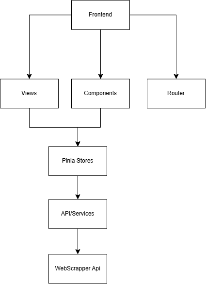
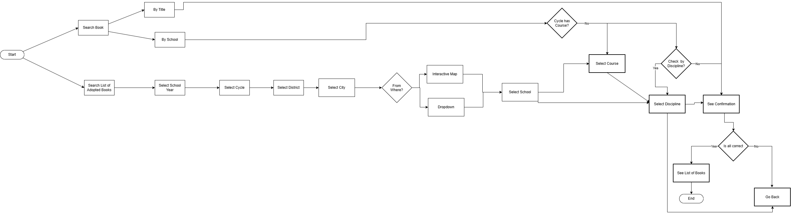
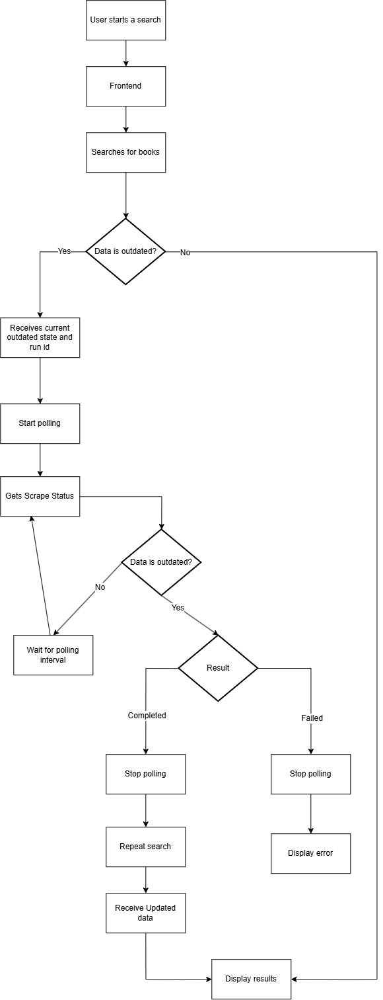

# WebScrapper-Frontend

Vue 3 web application for searching and consulting school textbooks collected from wook.pt. Consumes the [WebScrapperApi](https://github.com/ricardo4457/WebScrapperApi) (Laravel) and guides the user through a step-by-step wizard to reach the list of textbooks adopted by a given school, with price history and an interactive map of Portugal for geographic selection.

Related repositories:

- API/Backend (Laravel): [WebScrapperApi](https://github.com/ricardo4457/WebScrapperApi)
- Scraping service (Node.js): [WebScrapper](https://github.com/ricardo4457/WebScrapper)

---

## Requirements

- Node.js 18+
- The Laravel API running and reachable (see `VITE_API_URL` below)

---

## Running the project

```bash
npm install
npm run dev
```

```bash
npm run build     # production build
npx vitest run    # Vitest unit tests
```

### Environment variables

```env
VITE_API_URL=http://localhost:8000/api
VITE_APP_KEY=...   # sent as X-App-Key header, validated by Laravel's VerifyAppApiKey middleware
```

---

## Architecture



The app is organized by functional domain rather than by technical type, so a change to the search flow stays confined to `search-flow/` instead of spreading across unrelated folders. Data flows top-down: **Views/Components** read from **Pinia stores**, stores call **services** for HTTP access, and services talk to the Laravel API — components never call `axios` directly.

```
src/
├── views/                  # HomeView, BooksDetailView, PriceHistoryView, NotFoundView
├── components/
│   ├── layout/               # AppHeader, PageContainer, PageTitle
│   ├── common/                # ErrorState, EmptyState, PortugalMap, PriceTag, AsyncStatusBanner, ...
│   ├── search-flow/
│   │   ├── SearchWizard.vue    # step orchestrator
│   │   ├── SmartSearchInput.vue # quick search with autocomplete (books + schools)
│   │   └── steps/              # YearStep, TeachingCycleStep, DistrictStep, CityStep,
│   │                           # SchoolStep, CourseStep, DisciplineStep, ConfirmationStep
│   ├── books/                 # BookCard, BookList, BookCardBody, skeletons
│   └── history/               # PriceHistoryChart, PriceHistoryEmpty, skeleton
├── stores/                  # search.store, books.store, schools.store, app.store (Pinia)
├── services/                # books.service, schools.service, scraper.service, locations.service
├── composables/             # usePolling.js, useScrapeAwareFetch.js
├── api/                     # axios.js (instance), interceptors.js (401/403 handling)
├── data/                    # teaching-cycles.json, districts-cities.json, portugal-map/*.json (SVGs)
└── router/                  # index.js
```

---

## Core user flow: search wizard

The wizard is the main entry point of the app: year → teaching cycle → district/city (list or interactive map) → school → course (only when the cycle has one) → discipline → confirmation → results.



`search.store.js` drives this as a dynamic step list (`activeSteps`), not a fixed sequence — steps like `course` are removed or restored at runtime depending on whether the selected school/cycle actually has one, which is why the diagram branches on _"Cycle has Course?"_ before the discipline/course steps.

---

## Async flow: stale data & scraping polling

A search can return three different outcomes from the API: fresh cached data, stale cached data (shown immediately while a refresh runs in the background), or no data at all (a new scrape is triggered and the frontend polls until it completes).



This is implemented by `useScrapeAwareFetch.js` (wraps any request that may return a `202 scraping` response) and `usePolling.js` (generic polling of `GET /book-scraper/status/{runId}` with timeout handling), both consumed by `books.store.js` and `schools.store.js`.

---

## Actors & use cases


From the frontend's perspective, the relevant actor is **Website User**: search for books, consult adopted books by a school, and check scraping status. The **API User**, **WebScrapper API**, and **Scraping Service** actors belong to the backend/scraper repositories and are shown here only for context on how a frontend search can indirectly trigger a scrape.

---

## State management (Pinia)

| Store              | Responsibility                                                                                   |
| ------------------ | ------------------------------------------------------------------------------------------------ |
| `search.store.js`  | Wizard state: current step, active steps, user selections                                        |
| `books.store.js`   | Search results, pagination, stale/refresh polling, book detail, price history                    |
| `schools.store.js` | Districts/cities (static JSON), schools, courses, disciplines (all with scrape-on-miss fallback) |
| `app.store.js`     | Global snackbar / init state                                                                     |

---

## Testing

```bash
npx vitest run
```

Vitest suite covering stores, composables (with fake timers for polling), and service wrappers — no component-level tests yet (manual validation via the running app).

---

## License

MIT — see [LICENSE](LICENSE).

Este projeto está licenciado sob a **MIT License**. Consulte o ficheiro [LICENSE](LICENSE) para mais detalhes.
